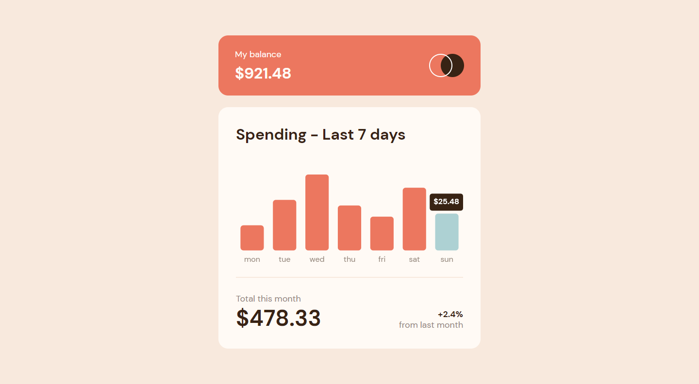

# Frontend Mentor - Expenses chart component solution

## Welcome! 👋

Thanks for checking out this front-end coding challenge solution.

## Table of contents

- [Overview](#overview)
  - [Preview Screenshot](#preview-screenshot)
  - [Links](#links)
- [My process](#my-process)
  - [Built with](#built-with)
- [Author](#author)

## Overview

This is a solution to the [Expenses chart component challenge on Frontend Mentor](https://www.frontendmentor.io/challenges/expenses-chart-component-e7yJBUdjwt). Frontend Mentor challenges help you improve your coding skills by building realistic projects.

### Preview Screenshot

### Links

- Solution URL: [github.com/lucasweidas/expenses-chart-component-main](https://github.com/lucasweidas/expenses-chart-component-main)
- Live Site URL: [lucasweidas.github.io/expenses-chart-component-main/](https://lucasweidas.github.io/expenses-chart-component-main/)

## My process

### Built with

- Semantic HTML5 markup
- CSS custom properties
- CSS Flex
- Mobile-first workflow
- SASS-SCSS
- Vite
- Chart.js

## Author

- Github - [@lucasweidas](https://github.com/LucasWeidas)
- Frontend Mentor - [@lucasweidas](https://www.frontendmentor.io/profile/lucasweidas)
- CodePen - [@lucasweidas](https://codepen.io/lucasweidas)
